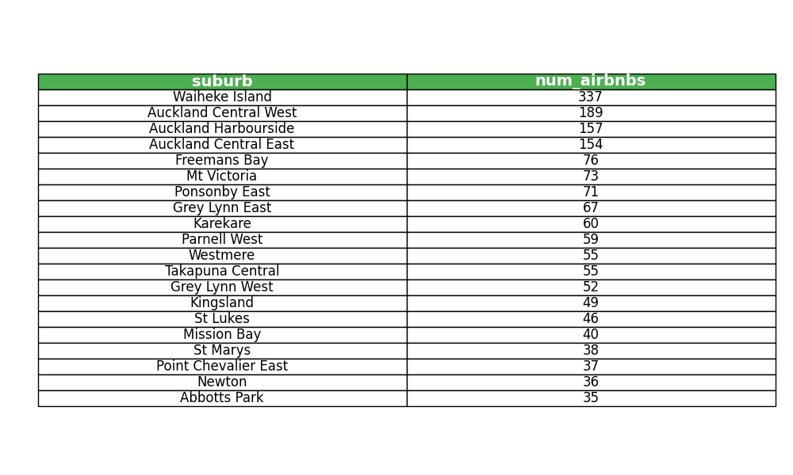
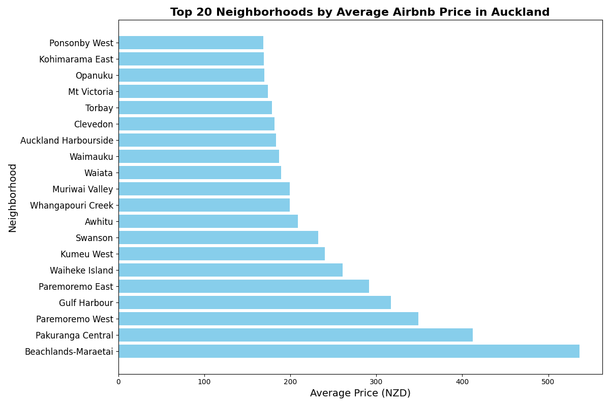
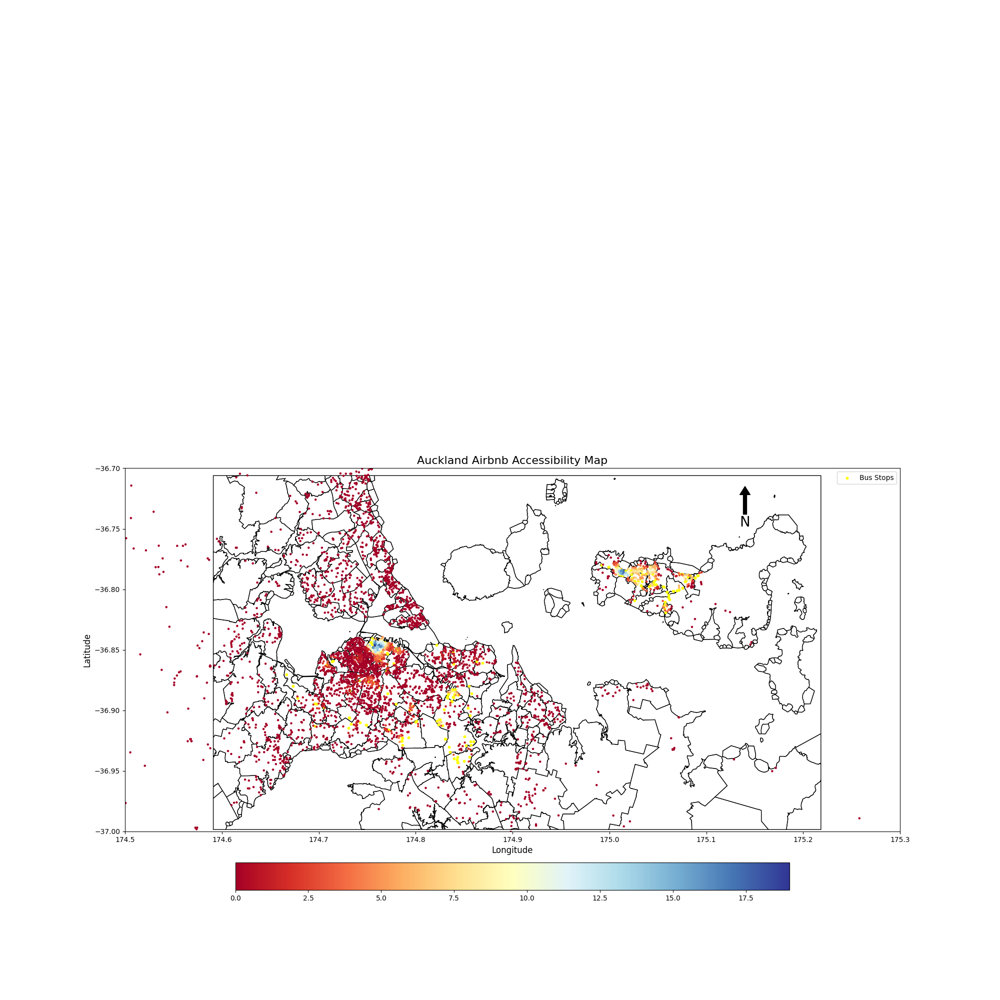
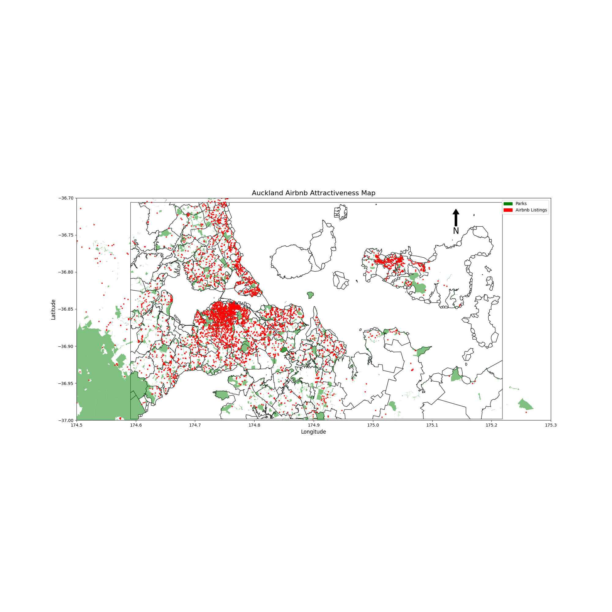

# 🏙️ Auckland Airbnb Accessibility & Attractiveness Analysis

📍 **GISCI343 Geospatial Data Science Project**  
🔬 **+ Microsoft Student Accelerator (MSA) ML Project Overview**

---

## 📘 Overview

This repository contains a comprehensive geospatial analysis of **Airbnb listings in Auckland, New Zealand**, focusing on their **accessibility** (proximity to public transport) and **attractiveness** (proximity to parks). It also links to the complementary machine learning project developed during the **Microsoft Student Accelerator (MSA) 2024**, where classification models were applied to solve real-world problems using Python.

---

## 🧭 Project 1: Airbnb Geospatial Analysis

### 🎯 Objective:
To help **travelers** and **property hosts** make informed decisions by analyzing spatial patterns related to:
- Airbnb density
- Pricing variation
- Accessibility to bus routes/stops
- Proximity to parks and green areas

### 📊 Key Visualizations:
- **Airbnb Listing Distribution by Suburb**  
  

- **Average Airbnb Price per Suburb**  
  

- **Accessibility Map (Bus Routes)**  
  

- **Price vs. Park Proximity**  
  

- **Attractiveness Map (Park Proximity)**  
  

### 🛠 Tech Stack:
- Python (GeoPandas, Pandas, SQLAlchemy)
- PostgreSQL + PostGIS
- QGIS
- CSV spatial datasets from LINZ, Auckland Council, and Airbnb (via Tom Slee)

📄 [Read Full Report (PDF)](./Airbnb%20Report.pdf)  
📓 [Notebook: `sbu696_GISCI343_Lab2.ipynb`](./sbu696_GISCI343_Lab2.ipynb)

---

## 🤖 Project 2: Microsoft Student Accelerator 2024 (ML Classification)

### 🎯 Objective:
Develop and iterate on **machine learning classification models** to predict real-world outcomes using structured datasets.

### 🧪 Key Tasks:
- Data cleaning and EDA with Pandas & Seaborn  
- Feature engineering and selection  
- Model training and optimization using **TensorFlow** and **Scikit-learn**  
- Evaluated with accuracy, precision, F1-score  
- Collaborated in an **agile team** to refine models iteratively

### 🛠 Tech Stack:
- Python: TensorFlow, Scikit-learn, Pandas, Seaborn, Matplotlib
- Jupyter Notebook
- Azure Cloud for scalable training (MSA)

💡 *This project demonstrated Elliot’s end-to-end ML workflow capabilities and strong collaboration in data-driven environments.*

---

## 🔧 Skills Demonstrated
- Geospatial Analytics & Visualization  
- Python Scripting for Data Science  
- Machine Learning (TensorFlow, Scikit-learn)  
- Data Cleaning & Feature Engineering  
- Power BI & DAX (in other projects)  
- Cloud Computing (Azure, Snowflake)  
- Version Control (Git & GitHub)

---

## 📁 Repo Contents

```bash
/
├── Airbnb Report.pdf                 # Final report (PDF)
├── README.md                        # This file
├── sbu696_GISCI343_Lab2.ipynb       # Main geospatial notebook
├── sbu696_GISCI343_Fig1.png         # Figure - Listing distribution
├── sbu696_GISCI343_Fig2.png         # Figure - Price map
├── sbu696_GISCI343_Fig3.png         # Figure - Accessibility
├── sbu696_GISCI343_Fig4.png         # Figure - Park proximity pricing
├── sbu696_GISCI343_Fig5.png         # Figure - Attractiveness map
├── table1.csv                       # Supporting dataset
